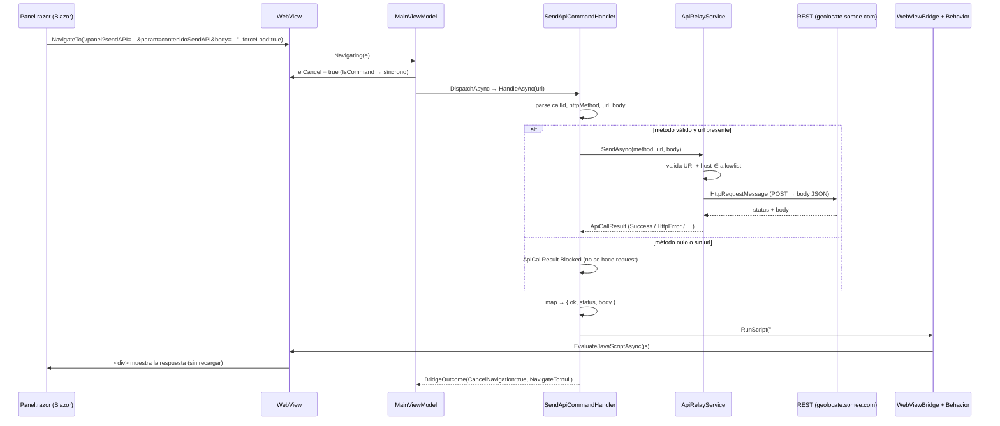

# Relay REST (sendAPI) en la arquitectura Web ↔ MAUI Híbrida

> Documenta la **secuencia de llamadas** y la **lógica asociada** cuando la página Blazor
> (`Ejemplo_ws_Blazor`) pide que la app **reenvíe un request REST** (con un `HttpClient` nativo) y le
> **devuelva la respuesta** al DOM **sin recargar** la página.
>
> Alcance: el comando `sendAPI=sendAPI`. El mecanismo general del puente (Canal B) está en
> [`maui-hibrido.md`](./maui-hibrido.md).

---

## 1. Panorama: rol dentro del Canal B

`sendAPI` convierte a la app en un **relay REST**: la web arma un request (verbo + URL + body) y lo
codifica en la URL de navegación; la app lo intercepta, ejecuta el request con su propio `HttpClient`
y **inyecta la respuesta serializada** en un elemento del DOM. Sigue la rama
"inyectar-JS-y-quedarse" (`BridgeOutcome(true, null)`), igual que QR y foto.

¿Por qué un relay y no un `fetch` desde Blazor? Porque el request sale del **cliente nativo** (no del
navegador): evita CORS, permite un **allowlist de hosts** del lado app, y centraliza timeout y manejo
de errores.

```
Panel.razor (OnSendAPI, forceLoad)
   └─► WebView.Navigating ─► MainViewModel.Navigating
            ├─ IsCommand → e.Cancel = true
            └─ Dispatcher.DispatchAsync
                   └─► SendApiCommandHandler.HandleAsync
                          ├─ parse: callId, httpMethod, url, body
                          ├─ ApiRelayService.SendAsync (allowlist + timeout 30s)
                          └─ bridge.RunScript(JS) ─► #{callId}.textContent = {ok,status,body}
```

---

## 2. Componentes que participan

| # | Componente | Archivo | Rol |
|---|---|---|---|
| 1 | `Panel.razor` | `Ejemplo_ws_Blazor/Components/Pages/Panel.razor` | Arma la URL (`OnSendAPI`) y aloja el `<div id="contenidoSendAPI">` destino |
| 2 | `SendApiCommandHandler` | `UrlCommands/Handlers/SendApiCommandHandler.cs` | Parsea la URL, delega en el service, inyecta la respuesta |
| 3 | `ApiRelayService` | `Services/ApiRelayService.cs` | Ejecuta el request (allowlist de hosts, timeout) y mapea a `ApiCallResult` |
| 4 | `ApiCallResult` | `Models/ApiCallResult.cs` | Resultado tipado (Success/HttpError/NetworkError/Timeout/Cancelled/Blocked) |
| 5 | `IWebViewBridge` + `WebViewBridgeBehavior` | `Behaviors/*` | Inyectan el JS en el DOM vivo |

Registro DI: `ApiRelayService` singleton (`MauiProgram.cs:72`), handler `MauiProgram.cs:95`
(**último** en el orden de evaluación).

---

## 3. La convención de URL (el "protocolo")

```
/panel?sendAPI=sendAPI&httpMethod=Post&url={enc}&param=contenidoSendAPI&body={enc}
        │              │               │          │                     │
        │              │               │          │                     └── body JSON url-encoded (sólo POST)
        │              │               │          └── param: id del DOM donde inyectar la respuesta (callId)
        │              │               └── url del destino real, url-encoded
        │              └── verbo: Post | Get (case-insensitive)
        └── comando que la app intercepta
```

- **`sendAPI=sendAPI`** → `SendApiCommandHandler.CanHandle` (`SendApiCommandHandler.cs:23-24`,
  `Contains("sendApi=sendApi", OrdinalIgnoreCase)` — matchea aunque la web escriba `sendAPI`).
- `httpMethod` → `ParseMethod` (`:50-55`): `Post`/`Get`; cualquier otro → `null` (se trata como
  `Blocked`, sin request).
- `url` y `body` van **url-encoded** (la web usa `HttpUtility.UrlEncode`); el handler los decodifica
  con `Uri.UnescapeDataString` en `GetQueryValue` (`:87-97`).

Origen en la web (`Panel.razor:234-242`):

```csharp
public void OnSendAPI()
{
    string body = "{\"Latitude\":-31.7496689,\"Longitude\":-60.5213019}";   // LocationDto de demo
    string parametrosSendAPI =
        $"sendAPI=sendAPI&httpMethod=Post&url={HttpUtility.UrlEncode("https://geolocate.somee.com/api/GeoReporter/track")}" +
        $"&param=contenidoSendAPI&body={HttpUtility.UrlEncode(body)}";
    Navigation.NavigateTo($"/panel?{parametrosSendAPI}", forceLoad: true);
}
```

Elemento destino: `<div id="contenidoSendAPI">` (`Panel.razor:93`).

---

## 4. Secuencia de llamadas (camino feliz)

### 4.1 Diagrama de secuencia



### 4.2 Intercepción y dispatch

`MainViewModel.Navigating` (`MainViewModel.cs:69-81`) cancela y delega. `SendApiCommandHandler` es el
**último** en el orden *first-match-wins* (`MauiProgram.cs:95`): sólo gana si la URL no matcheó antes
`coordenadas`/`phone`/`photo`/`selfie`/`qr`. (Ver §6 sobre el combo con `phone`.)

### 4.3 Handler (`SendApiCommandHandler.HandleAsync`)

`SendApiCommandHandler.cs:26-47`:

```csharp
var callId = GetQueryValue(url, "param") ?? "";
var verbo  = GetQueryValue(url, "httpMethod");
var destino = GetQueryValue(url, "url");
var body    = GetQueryValue(url, "body");

var method = ParseMethod(verbo);

// Verbo desconocido o sin destino: no se llama al service (se trata como Blocked).
ApiCallResult result = (method is null || string.IsNullOrEmpty(destino))
    ? new ApiCallResult.Blocked()
    : await _api.SendAsync(method, destino, body);

EntregarAlHook(callId, result);
return new BridgeOutcome(true, null);     // se queda en la página
```

### 4.4 Servicio (`ApiRelayService.SendAsync`)

`ApiRelayService.cs:28-64`. Puntos clave:

- **Allowlist de hosts** (`:15-18`, `:31`): sólo `geolocate.somee.com`. URL inválida o host fuera de
  la lista → `ApiCallResult.Blocked` (no se hace el request). Es el guardrail de seguridad del relay.
- **Timeout** de 30 s vía `CancellationTokenSource.CreateLinkedTokenSource` + `CancelAfter` (`:20`,
  `:34-35`).
- **Body sólo en POST** (`Content-Type: application/json`); en GET se ignora (`:38-39`).
- **Mapeo** del resultado (`:47-49`): `< 400` → `Success`, `>= 400` → `HttpError`; y los `catch`
  traducen a `Cancelled` / `Timeout` / `NetworkError` (`:51-63`). Sin excepciones propagadas.

### 4.5 Entrega al DOM (`EntregarAlHook`)

`SendApiCommandHandler.cs:57-85` reduce el `ApiCallResult` a una tupla `(ok, status, body)`, arma un
`payload { ok, status, body }` y lo inyecta:

```csharp
var payload = new { ok, status, body };
string scriptjs = $@"
document.getElementById('{callId}').textContent= '{JsonSerializer.Serialize(payload)}';";
_bridge.RunScript(scriptjs);
```

`RunScript` → `WebViewBridgeBehavior.OnScriptRequested` (`WebViewBridgeBehavior.cs:65`) →
`EvaluateJavaScriptAsync` en UI thread → el `<div id="contenidoSendAPI">` muestra el JSON de la
respuesta. `BridgeOutcome(true, null)` → se queda en la página.

---

## 5. Lógica y decisiones de diseño

| Decisión | Dónde | Por qué |
|---|---|---|
| Relay nativo en vez de `fetch` en Blazor | todo el flujo | Evita CORS; el request sale del cliente nativo con allowlist propio |
| **Allowlist** de hosts | `ApiRelayService.cs:15-18,31` | Guardrail: sólo se permiten destinos conocidos; el resto → `Blocked` |
| Timeout 30 s con CTS enlazado | `ApiRelayService.cs:20,34-35` | Acotar requests colgados sin bloquear la UI |
| `ApiCallResult` tipado | `Models/ApiCallResult.cs` | El handler hace `switch`; sin `try/catch` propagado a la UI |
| Método inválido / sin url ⇒ `Blocked` sin llamar al service | `SendApiCommandHandler.cs:40-42` | No emitir requests mal formados |
| `param` = id del DOM (callId) | `SendApiCommandHandler.cs:28` | La respuesta aterriza en un elemento concreto de la página |
| `BridgeOutcome(true, null)` | `SendApiCommandHandler.cs:46` | Se queda en la página; resultado por JS |

---

## 6. Variante: el combo "Llamar y reportar"

`OnLLamarYSendAPI` (`Panel.razor:172-181`) arma `phone=phone&sendAPI=sendAPI&…`. Como el dispatcher es
*first-match-wins* y **Call** se evalúa **antes** que **SendApi** (`MauiProgram.cs:91` vs `:95`), en
ese combo **sólo dispara la llamada** y el relay **no** se ejecuta. Por eso `sendAPI` se ejercita solo
en `OnSendAPI`. (Detalle de la llamada en [`llamada.md`](./llamada.md).)

---

## 7. ⚠️ Observaciones

### 7.1 El hook `recibirRespuestaApi` está en desuso

La web registra en `OnAfterRenderAsync` un hook JS `window.recibirRespuestaApi(callId, res)` que
escribe en un elemento `apiOut` (`Panel.razor:132-137`). Pero:

- El handler **no** lo llama: la versión que invocaba `window.recibirRespuestaApi(...)` está
  **comentada** (`SendApiCommandHandler.cs:71-73`); el código activo escribe `textContent` directo al
  `callId`.
- Además **no existe** ningún elemento con id `apiOut` en `Panel.razor` (el destino real es
  `contenidoSendAPI`, `:93`), así que el hook, aun si se llamara, no mostraría nada.

Es decir, el hook es **doblemente inerte** hoy. No rompe nada (el `if (el)` lo protege), pero es código
muerto.

### 7.2 La inyección envuelve JSON en comillas simples (menos robusta)

El código activo hace `textContent = '{JsonSerializer.Serialize(payload)}'` (`:76-77`): serializa el
payload y lo **envuelve en comillas simples** en el JS. Si el `body` de la respuesta contuviera una
comilla simple, un backslash o un salto de línea, el string JS podría **romperse** (o abrir la puerta a
inyección). La versión comentada (`:71-73`) pasaba el payload como **valor JS** (`window.recibirRespuestaApi(callId, {payload})`),
que es la forma segura — el mismo criterio que usa el handler de QR
([`lectura-qr.md`](./lectura-qr.md) §5, "serialización segura"). Con el endpoint actual
(`/track`, respuesta controlada) no se dispara, pero es un riesgo latente.

> Este documento **describe**, no corrige.

---

## 8. Referencia rápida de archivos

| Archivo | Líneas clave |
|---|---|
| `Ejemplo_ws_Blazor/Components/Pages/Panel.razor` | `93` (div destino), `132-137` (hook en desuso), `234-242` (`OnSendAPI`) |
| `Ejemplo_Maui_Hibrida/UrlCommands/Handlers/SendApiCommandHandler.cs` | `23-24` (`CanHandle`), `26-47` (`HandleAsync`), `50-55` (`ParseMethod`), `57-85` (`EntregarAlHook`) |
| `Ejemplo_Maui_Hibrida/Services/ApiRelayService.cs` | `15-18` (allowlist), `20` (timeout), `28-64` (`SendAsync`), `47-49` (mapeo) |
| `Ejemplo_Maui_Hibrida/Models/ApiCallResult.cs` | resultado tipado |
| `Ejemplo_Maui_Hibrida/Behaviors/WebViewBridgeBehavior.cs` | `65` (`EvaluateJavaScriptAsync`) |
| `Ejemplo_Maui_Hibrida/MauiProgram.cs` | `72` (`ApiRelayService`), `95` (handler, último) |

> Relacionado: [`maui-hibrido.md`](./maui-hibrido.md) (Canal B y GPS) · [`lectura-qr.md`](./lectura-qr.md) ·
> [`captura-foto.md`](./captura-foto.md) · [`llamada.md`](./llamada.md).
