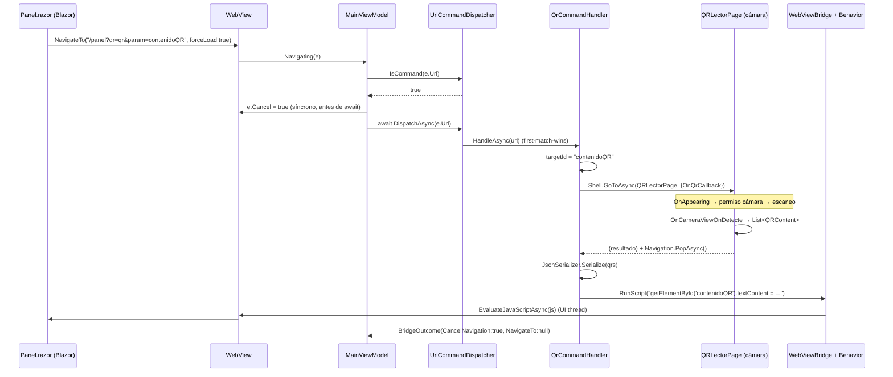

# Lectura de QR en la arquitectura Web ↔ MAUI Híbrida

> Documenta la **secuencia de llamadas** y la **lógica asociada** cuando la página Blazor
> (`Ejemplo_ws_Blazor`, servida en un web service) dispara la lectura de un QR y la app
> contenedora (`Ejemplo_Maui_Hibrida`) la intercepta, abre la cámara y devuelve el resultado
> al DOM **sin recargar** la página.
>
> Alcance: el caso `qr=qr`. El resto de comandos (`photo`, `selfie`, `phone`, `coordenadas`,
> `sendAPI`) comparten el mismo mecanismo y se citan sólo como contraste.

---

## 1. Panorama general

La app es un **híbrido**: un `WebView` MAUI hospeda una web Blazor remota (`https://aplicada.somee.com`,
fijada en `Pages/MainPage.xaml.cs:18`). La web **no** tiene acceso a la cámara/GPS/teléfono del
dispositivo; la app sí. El puente entre ambos mundos es una **convención sobre la URL**:

- La web navega a una URL "marcada" (ej. `/panel?qr=qr&param=contenidoQR`).
- La app **intercepta** esa navegación en el evento `Navigating` del `WebView`, la **cancela**,
  ejecuta la acción nativa (abrir el lector de QR) y **devuelve el resultado inyectando JavaScript**
  en el DOM vivo de la propia página.

La web nunca recarga: sólo se le actualiza el contenido de un elemento por su `id`.

```
┌─────────────────────────┐         URL marcada          ┌──────────────────────────────┐
│  Web (Blazor)            │   /panel?qr=qr&param=...     │  App MAUI (WebView host)       │
│  Panel.razor             │ ───────────────────────────► │  intercepta · cancela · actúa  │
│                          │                              │                                │
│  <div id="contenidoQR">  │ ◄─────────────────────────── │  inyecta JS: textContent = ... │
└─────────────────────────┘   EvaluateJavaScriptAsync     └──────────────────────────────┘
```

---

## 2. Componentes que participan

| # | Componente | Archivo | Rol en el flujo QR |
|---|---|---|---|
| 1 | `Panel.razor` | `Ejemplo_ws_Blazor/Components/Pages/Panel.razor` | Dispara la URL marcada (`OnQR`) y aloja el `<div id="contenidoQR">` destino |
| 2 | `WebView` + behaviors | `Ejemplo_Maui_Hibrida/Pages/MainPage.xaml` | Levanta `Navigating`; aloja el `WebViewBridgeBehavior` |
| 3 | `WebNavigatingEventArgsConverter` | `Converters/WebNavigatingEventArgsConverter.cs` | Traduce el `EventArgs` del WebView para el comando del VM |
| 4 | `MainViewModel` | `ViewModels/MainViewModel.cs` | Recibe `Navigating`, cancela y delega en el dispatcher |
| 5 | `UrlCommandDispatcher` | `UrlCommands/UrlCommandDispatcher.cs` | Elige el handler (*first-match-wins*) |
| 6 | `QrCommandHandler` | `UrlCommands/Handlers/QrCommandHandler.cs` | Orquesta: navega al lector, espera, inyecta JS |
| 7 | `QRLectorPage` | `Pages/QRLectorPage.xaml(.cs)` | Cámara + escaneo (lib `BarcodeScanning`) |
| 8 | `IWebViewBridge` / `WebViewBridge` | `Behaviors/WebViewBridge.cs` | Puente desacoplado: el handler pide "ejecutá este JS" |
| 9 | `WebViewBridgeBehavior` | `Behaviors/WebViewBridgeBehavior.cs` | Único que toca el control: hace `EvaluateJavaScriptAsync` |
| 10 | `BridgeOutcome` | `UrlCommands/BridgeOutcome.cs` | Resultado: ¿cancelar navegación? ¿re-navegar a dónde? |
| 11 | `QRContent` | `Models/QRContent.cs` | DTO `{ Type, Value }` de cada código leído |

Registro DI y orden de evaluación de handlers: `MauiProgram.cs:90-96`.
Registro de ruta del lector: `AppShell.xaml.cs:12` (`Routing.RegisterRoute(nameof(QRLectorPage), …)`).

---

## 3. La convención de URL (el "protocolo")

La URL marcada para QR tiene dos partes significativas:

```
/panel?qr=qr&param=contenidoQR
        │        │
        │        └── param: id del elemento del DOM donde inyectar el resultado
        └── qr=qr: el "comando" que la app reconoce e intercepta
```

- **`qr=qr`** → activa `QrCommandHandler.CanHandle` (`QrCommandHandler.cs:20-21`):
  `url.Contains("qr=qr", …)`.
- **`param=contenidoQR`** → el `id` del `<div>` destino. El handler lo extrae con `GetQueryValue`
  (`QrCommandHandler.cs:51-61`). Si falta, el handler **cancela y no hace nada**
  (`QrCommandHandler.cs:25-27`).

Origen en la web (`Panel.razor:248-252`):

```csharp
public void OnQR()
{
    string parametrosQR = $"qr=qr&param=contenidoQR";
    Navigation.NavigateTo($"/panel?{parametrosQR}", forceLoad: true);
}
```

> **Clave — `forceLoad: true`:** fuerza una navegación de **documento completo** (no un
> enrutamiento interno de Blazor). Sólo así el `WebView` dispara `Navigating` con esa URL y la app
> puede interceptarla. Sin `forceLoad`, Blazor resolvería la ruta en cliente y la app nunca se entera.

El `<div>` destino vive en `Panel.razor:104`:

```razor
<div id="contenidoQR">@QRContenido</div>
```

---

## 4. Secuencia de llamadas (camino feliz)

### 4.1 Diagrama de secuencia



### 4.2 Disparo desde la web

`Panel.razor:248-252` → `Navigation.NavigateTo(..., forceLoad: true)`.
El `WebView` intenta navegar de verdad y dispara su evento `Navigating`.

### 4.3 Intercepción en el WebView

`MainPage.xaml:30-32` cablea el evento con `EventToCommandBehavior` (CommunityToolkit), pasando por
el converter `WebNavigatingEventArgsConverter` (`Converters/WebNavigatingEventArgsConverter.cs:7-8`,
que sólo castea el `EventArgs`):

```xml
<toolkit:EventToCommandBehavior EventName="Navigating"
    EventArgsConverter="{StaticResource NavigatingConverter}"
    Command="{Binding BindingContext.NavigatingCommand, Source={x:Reference page}}" />
```

### 4.4 Cancelar y delegar (`MainViewModel.Navigating`)

`MainViewModel.cs:69-81`:

```csharp
[RelayCommand]
private async Task Navigating(WebNavigatingEventArgs e)
{
    if (_dispatcher.IsCommand(e.Url))
        e.Cancel = true;   // sincrónico: cancelar ANTES de cualquier await

    var outcome = await _dispatcher.DispatchAsync(e.Url);

    if (outcome.NavigateTo is not null)
        Url = outcome.NavigateTo;

    IsRefreshing = false;
}
```

> **Clave — `e.Cancel` síncrono:** la cancelación de la navegación del `WebView` debe ocurrir
> **antes** del primer `await`. Si se pospusiera, el control ya habría iniciado la navegación real y
> la página recargaría. Por eso hay dos llamadas al dispatcher: `IsCommand` (síncrono, sólo decide
> cancelar) y `DispatchAsync` (asíncrono, ejecuta el comando).

### 4.5 Selección del handler (`UrlCommandDispatcher`)

`UrlCommandDispatcher.cs:17-27` recorre los handlers **en orden de registro** y delega en el primero
cuyo `CanHandle` sea `true` (*first-match-wins*, principio abierto/cerrado: agregar un comando =
una clase + una línea de DI):

```csharp
public async Task<BridgeOutcome> DispatchAsync(string url)
{
    foreach (var handler in _handlers)
        if (handler.CanHandle(url))
            return await handler.HandleAsync(url);

    return new BridgeOutcome(false, url);   // ningún comando: navegación normal
}
```

Orden de registro (`MauiProgram.cs:90-95`): **Gps → Call → Camera → Selfie → Qr → SendApi**.
Para `qr=qr&param=contenidoQR` ninguno previo matchea, así que gana `QrCommandHandler`.

### 4.6 Orquestación del QR (`QrCommandHandler.HandleAsync`)

`QrCommandHandler.cs:23-49`:

```csharp
public async Task<BridgeOutcome> HandleAsync(string url)
{
    var targetId = GetQueryValue(url, "param");          // "contenidoQR"
    if (string.IsNullOrEmpty(targetId))
        return new BridgeOutcome(true, null);

    // Navegar al lector y esperar la lista con TaskCompletionSource.
    var tcs = new TaskCompletionSource<List<QRContent>?>();
    Action<List<QRContent>?> callback = qrs => tcs.TrySetResult(qrs);

    await Shell.Current.GoToAsync(nameof(QRLectorPage),
        new ShellNavigationQueryParameters { { "OnQrCallback", callback } });

    var qrs = await tcs.Task;                 // null o vacío = canceló
    if (qrs is null || qrs.Count == 0)
        return new BridgeOutcome(true, null);

    // Inyectar la LISTA COMPLETA serializada (a prueba de comillas vía JsonSerializer).
    var json = JsonSerializer.Serialize(qrs);
    string scriptjs =
        $"document.getElementById({JsonSerializer.Serialize(targetId)}).textContent = {JsonSerializer.Serialize(json)};";

    _bridge.RunScript(scriptjs);

    return new BridgeOutcome(true, null);     // se queda en la página
}
```

> **Clave — `TaskCompletionSource` como "modal asíncrono":** `GoToAsync` empuja la página del lector,
> pero `HandleAsync` necesita **esperar** a que el usuario escanee (o cancele). El `TCS` convierte ese
> ciclo navegar→escanear→volver en un `await` lineal: el handler queda suspendido en `await tcs.Task`
> hasta que alguien complete el `callback`.

> **Clave — serialización segura:** tanto el `id` como el JSON se pasan por `JsonSerializer.Serialize`,
> que produce literales JS con comillas escapadas. Evita romper el script si el valor del QR contiene
> comillas, backslashes o saltos de línea.

### 4.7 Escaneo y retorno (`QRLectorPage`)

- `OnAppearing` (`QRLectorPage.xaml.cs:107-127`): pide permiso de cámara
  (`BarcodeScanning.Methods.AskForRequiredPermissionAsync`), arma el layout según orientación.
- La `CameraView` (`QRLectorPage.xaml:23-28`, formatos `QRCode,Code39`) dispara
  `OnCameraViewOnDetecte` al detectar (`QRLectorPage.xaml.cs:47-65`):

```csharp
private void OnCameraViewOnDetecte(object sender, OnDetectionFinishedEventArg e)
{
    List<QRContent> QRs = new();
    foreach (var b in e.BarcodeResults)
    {
        string type = b.BarcodeType == BarcodeTypes.Unknown ? "Text" : b.BarcodeType.ToString();
        QRs.Add(new QRContent { Type = type, Value = b.DisplayValue });
    }
    if (QRs.Count == 0) return;

    this.Dispatcher.Dispatch(async () =>
    {
        Camera.CameraEnabled = false;   // detener cámara
        CompletarResultado(QRs);
        await Navigation.PopAsync();    // volver a MainPage
    });
}
```

- `CompletarResultado` (`QRLectorPage.xaml.cs:129-135`) usa `Interlocked.Exchange` para garantizar
  **una sola** entrega del resultado y completa `ResultadoTask`.
- "Volver" (`OnVolverClicked`, `QRLectorPage.xaml.cs:81-86`) entrega **lista vacía** = cancelado.

### 4.8 Inyección del resultado en el DOM

El handler **no toca el `WebView`**: pide la acción al puente.
`WebViewBridge.RunScript` (`Behaviors/WebViewBridge.cs:11`) sólo levanta el evento `ScriptRequested`;
la behavior `WebViewBridgeBehavior.OnScriptRequested` (`Behaviors/WebViewBridgeBehavior.cs:65`) es la
única que toca el control, **siempre en el UI thread** y *fire-and-forget*:

```csharp
private void OnScriptRequested(object? sender, string js) =>
    MainThread.BeginInvokeOnMainThread(() => _ = _webView?.EvaluateJavaScriptAsync(js));
```

Resultado: `document.getElementById('contenidoQR').textContent = '<json>'` corre en el DOM vivo y el
`<div>` se actualiza **sin recargar** la página.

### 4.9 Cierre

`HandleAsync` retorna `BridgeOutcome(CancelNavigation: true, NavigateTo: null)`
(`UrlCommands/BridgeOutcome.cs`). Como `NavigateTo` es `null`, `MainViewModel.Navigating` **no**
cambia `Url`: la página se queda donde estaba.

---

## 5. Lógica y decisiones de diseño asociadas

| Decisión | Dónde | Por qué |
|---|---|---|
| URL como protocolo (`qr=qr&param=…`) | `Panel.razor` ↔ handlers | La web no tiene API nativa; la URL es el canal común sin acoplar al control |
| `forceLoad: true` en la web | `Panel.razor:245` | Forzar navegación de documento para que `Navigating` se dispare |
| `IsCommand` síncrono + `e.Cancel` antes del `await` | `MainViewModel.cs:72-73` | Cancelar la navegación real antes de cederle el hilo al `await` |
| Dispatcher *first-match-wins* sin `switch` | `UrlCommandDispatcher.cs:19-24` | Abierto/cerrado: nuevo comando = clase + 1 línea de DI |
| `TaskCompletionSource` para esperar el escaneo | `QrCommandHandler.cs:30-36` | Convierte navegar→escanear→volver en un `await` lineal |
| Puente `IWebViewBridge` desacoplado | `Behaviors/WebViewBridge*.cs` | El VM/handler nunca tocan el `WebView`; sólo la behavior lo hace, en UI thread |
| `JsonSerializer.Serialize` del `id` y del valor | `QrCommandHandler.cs:42-44` | Escapado seguro: el QR puede traer comillas/backslashes |
| Se inyecta la **lista completa** | `QrCommandHandler.cs:42` | La web decide si toma `[0].Value` o itera varios códigos |
| `Interlocked.Exchange` en `CompletarResultado` | `QRLectorPage.xaml.cs:131` | Entregar el resultado una sola vez (anti doble-disparo) |

---

## 6. Variante: disparo desde botón nativo

Además del flujo web, hay un botón nativo "Leer QR" en `MainPage.xaml:52` que invoca
`MainViewModel.TakeQR` (`MainViewModel.cs:47-51`):

```csharp
[RelayCommand]
private async Task TakeQR()
{
    _ = await _dispatcher.DispatchAsync("qr=qr&param=contenidoQR");
}
```

Reusa el **mismo** dispatcher y handler con el mismo "protocolo" de URL: la única diferencia es que el
disparo no viene del `WebView` sino de un botón MAUI. Por eso el flujo converge en el mismo
`QrCommandHandler`.

---

## 7. ⚠️ Discrepancia en el cableado actual del callback

> Estado al momento de escribir este doc (rama `main`, refactor en curso: commits `bsn.lectorqr_dialog ios`).
> El flujo **visual** funciona (la cámara abre, escanea y vuelve), pero **el resultado no llega al DOM**.

El handler entrega el resultado por un callback nombrado **`OnQrCallback`** y se suspende en
`await tcs.Task`, que **sólo** se completa si ese callback se invoca:

```csharp
// QrCommandHandler.cs:30-36
Action<List<QRContent>?> callback = qrs => tcs.TrySetResult(qrs);
await Shell.Current.GoToAsync(nameof(QRLectorPage),
    new ShellNavigationQueryParameters { { "OnQrCallback", callback } });
var qrs = await tcs.Task;
```

Pero `QRLectorPage`:

- **No** declara `[QueryProperty(nameof(OnQrCallback), "OnQrCallback")]`.
- **No** tiene una propiedad `OnQrCallback`.
- En su lugar completa un `ResultadoTask` **propio** (`QRLectorPage.xaml.cs:12,133`) que **nadie lee**
  desde el handler.

Como Shell ignora silenciosamente un parámetro de navegación sin propiedad destino, el `callback`
**nunca se inyecta ni se invoca** → `tcs.Task` **nunca se completa** → el handler queda colgado en
`await tcs.Task` → el JS de inyección (paso 4.8) **no se ejecuta** y `#contenidoQR` no se actualiza.

### 7.1 Contraste con el flujo de foto (que sí está completo)

| Aspecto | Foto (✅ completo) | QR (⚠️ roto) |
|---|---|---|
| Handler pasa callback | `OnPhotoCallback` (`CameraCommandHandler.cs:34-35`) | `OnQrCallback` (`QrCommandHandler.cs:33-34`) |
| Página declara `[QueryProperty]` | **Sí** (`MyMediaPickerPage.xaml.cs:8`) | **No** |
| Página expone la propiedad | `Action<string?>? OnPhotoCallback` (`MyMediaPickerPage.xaml.cs:15`) | **No existe** |
| Página invoca el callback | `callback?.Invoke(tempPath)` (`MyMediaPickerPage.xaml.cs:304`); cancela con `OnPhotoCallback?.Invoke(null)` (`:200`) | Completa `ResultadoTask` (`:133`), que el handler no lee |
| ¿`tcs.Task` se completa? | Sí | **No** |

### 7.2 Forma del arreglo (a confirmar con el autor)

Para alinear QR con el patrón de foto, `QRLectorPage` debería:

1. Anotar la clase con `[QueryProperty(nameof(OnQrCallback), "OnQrCallback")]`.
2. Exponer `public Action<List<QRContent>?>? OnQrCallback { get; set; }`.
3. Invocar `OnQrCallback?.Invoke(QRs)` (y `Invoke(new List<QRContent>())` / `null` al cancelar) en
   lugar de — o además de — completar `ResultadoTask`.

> Este documento **describe**, no corrige. El detalle queda registrado para decidir el arreglo.

---

## 8. Referencia rápida de archivos

| Archivo | Líneas clave |
|---|---|
| `Ejemplo_ws_Blazor/Components/Pages/Panel.razor` | `104` (div destino), `248-252` (`OnQR`) |
| `Ejemplo_Maui_Hibrida/Pages/MainPage.xaml` | `26-37` (WebView + behaviors), `52` (botón QR) |
| `Ejemplo_Maui_Hibrida/Pages/MainPage.xaml.cs` | `18` (URL inicial) |
| `Ejemplo_Maui_Hibrida/Converters/WebNavigatingEventArgsConverter.cs` | `7-8` |
| `Ejemplo_Maui_Hibrida/ViewModels/MainViewModel.cs` | `47-51` (`TakeQR`), `69-81` (`Navigating`) |
| `Ejemplo_Maui_Hibrida/UrlCommands/UrlCommandDispatcher.cs` | `15` (`IsCommand`), `17-27` (`DispatchAsync`) |
| `Ejemplo_Maui_Hibrida/UrlCommands/Handlers/QrCommandHandler.cs` | `20-21` (`CanHandle`), `23-49` (`HandleAsync`) |
| `Ejemplo_Maui_Hibrida/Pages/QRLectorPage.xaml(.cs)` | `.xaml:23-28` (cámara), `.cs:47-65`, `129-135`, `81-86` |
| `Ejemplo_Maui_Hibrida/Behaviors/WebViewBridge.cs` | `11` (`RunScript`) |
| `Ejemplo_Maui_Hibrida/Behaviors/WebViewBridgeBehavior.cs` | `65` (`OnScriptRequested`) |
| `Ejemplo_Maui_Hibrida/UrlCommands/BridgeOutcome.cs` | record completo |
| `Ejemplo_Maui_Hibrida/Models/QRContent.cs` | DTO `{ Type, Value }` |
| `Ejemplo_Maui_Hibrida/MauiProgram.cs` | `90-96` (orden de handlers), `43` (`UseBarcodeScanning`) |
| `Ejemplo_Maui_Hibrida/AppShell.xaml.cs` | `12` (ruta `QRLectorPage`) |

> Documentación relacionada: análisis de la librería de escaneo y migración de NuGet en
> [`../qr-nuget/README.md`](../qr-nuget/README.md).
