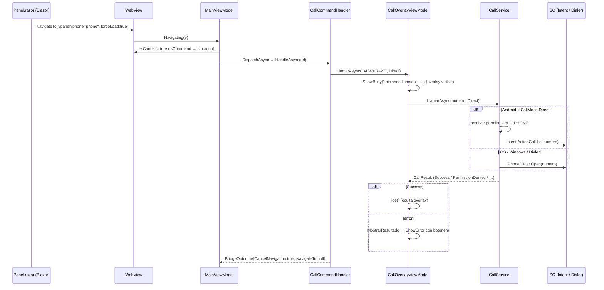

# Llamada telefónica en la arquitectura Web ↔ MAUI Híbrida

> Documenta la **secuencia de llamadas** y la **lógica asociada** cuando la página Blazor
> (`Ejemplo_ws_Blazor`) pide **realizar una llamada** y la app contenedora (`Ejemplo_Maui_Hibrida`)
> intercepta la URL y dispara la llamada nativa mostrando un **overlay de estado**.
>
> Alcance: el comando `phone=phone`. El mecanismo general del puente (Canal B) está en
> [`maui-hibrido.md`](./maui-hibrido.md).

---

## 1. Panorama: rol dentro del Canal B

La llamada es el comando más **simple** del puente: no devuelve nada al DOM (no inyecta JS ni
re-navega). Su "salida" es un **efecto nativo** (iniciar la llamada) y un **overlay** de estado sobre
el `WebView` que informa progreso/errores.

A diferencia de foto/selfie/QR, **no abre una página modal** ni usa `TaskCompletionSource`: llama
directo a un servicio (`CallService`) a través de su ViewModel de overlay (`CallOverlayViewModel`) y
retorna `BridgeOutcome(true, null)` (cancela la navegación, se queda en la página).

```
Panel.razor (OnLLamar, forceLoad)
   └─► WebView.Navigating ─► MainViewModel.Navigating
            ├─ IsCommand → e.Cancel = true
            └─ Dispatcher.DispatchAsync
                   └─► CallCommandHandler.HandleAsync
                          └─ CallOverlayViewModel.LlamarAsync(numero, Direct)
                                 ├─ ShowBusy (overlay)
                                 └─ CallService.LlamarAsync
                                        ├─ Android + Direct → Intent.ActionCall (permiso CALL_PHONE)
                                        └─ resto → PhoneDialer.Open (marcador del SO)
```

---

## 2. Componentes que participan

| # | Componente | Archivo | Rol |
|---|---|---|---|
| 1 | `Panel.razor` | `Ejemplo_ws_Blazor/Components/Pages/Panel.razor` | Dispara la URL (`OnLLamar`) |
| 2 | `CallCommandHandler` | `UrlCommands/Handlers/CallCommandHandler.cs` | Interpreta `phone=phone`; llama al VM del overlay |
| 3 | `CallOverlayViewModel` | `ViewModels/CallOverlayViewModel.cs` | Muestra estado (busy/error) y compone permisos + resultado |
| 4 | `CallService` | `Services/CallService.cs` | Ejecuta la llamada según plataforma/modo; devuelve `CallResult` tipado |
| 5 | `CallMode` / `CallResult` / `CallPermissionResult` | `Models/*` | Enums y resultado tipado (sin try/catch propagado) |
| 6 | `StatusOverlayViewModel` | `ViewModels/StatusOverlayViewModel.cs` | Base del overlay (None/Busy/Error + botonera) |
| 7 | `StatusOverlayView` | `Controls/StatusOverlayView.xaml` | UI del overlay sobre el `WebView` (`MainPage.xaml:47`) |

Registro DI: `CallService` singleton (`MauiProgram.cs:71`), `CallOverlayViewModel` singleton
(`MauiProgram.cs:85`), handler `MauiProgram.cs:91`.

---

## 3. La convención de URL (el "protocolo")

```
/panel?phone=phone
        │
        └── comando; NO lleva `param` (no hay resultado que devolver al DOM)
```

- **`phone=phone`** → `CallCommandHandler.CanHandle` (`CallCommandHandler.cs:18`).
- El número es **fijo** en el handler: `NumeroPorDefecto = "3434807427"` (`CallCommandHandler.cs:9`).
  La web no lo envía.

Origen en la web (`Panel.razor:168-171`):

```csharp
public void OnLLamar()
    => Navigation.NavigateTo("/panel?phone=phone", forceLoad: true);
```

---

## 4. Secuencia de llamadas (camino feliz)

### 4.1 Diagrama de secuencia



### 4.2 Intercepción y dispatch

`MainViewModel.Navigating` (`MainViewModel.cs:69-81`) cancela síncronamente y delega en el dispatcher.
Orden *first-match-wins* **Gps → Call → …** (`MauiProgram.cs:90-95`): `phone=phone` matchea en Call.

### 4.3 Handler (`CallCommandHandler`)

Es un pass-through delgado (`CallCommandHandler.cs:20-24`):

```csharp
public async Task<BridgeOutcome> HandleAsync(string url)
{
    _ = await _call.LlamarAsync(NumeroPorDefecto, CallMode.Direct);
    return new BridgeOutcome(true, null);     // se queda en la página
}
```

### 4.4 Overlay (`CallOverlayViewModel.LlamarAsync`)

`CallOverlayViewModel.cs:26-43`: guarda el último número/modo (para reintentos), muestra la capa de
espera y delega en el servicio; si el resultado es `Success` oculta el overlay, si no lo traduce a una
capa de error con botonera:

```csharp
ShowBusy("Iniciando llamada", "Aguarde un instante, conectando la llamada…", "timer.gif");
var result = await _callService.LlamarAsync(numero, mode);
if (result is CallResult.Success) { Hide(); return result; }
MostrarResultado(result);   // ShowError con acciones según el caso
```

`MostrarResultado` (`:88-128`) mapea cada `CallResult` a una UI: permiso denegado (con "Pedir permiso"
o "Abrir configuración" según `CanRetry`), restringido, no soportado, número inválido, cancelado, o
fallo (con "Reintentar"). Comandos de la botonera: `PedirPermiso`/`Reintentar`/`AbrirAjustes`/
`CerrarOverlay` (`:45-61`).

### 4.5 Servicio (`CallService`) — estrategia por plataforma

`CallService.LlamarAsync` (`CallService.cs:24-39`) elige mecánica según plataforma y modo:

| Contexto | Mecánica | Permiso |
|---|---|---|
| **Android** + `CallMode.Direct` | `Intent.ActionCall` (`tel:numero`), marca **sin confirmación** (`:70-107`, `:96`) | Runtime `CALL_PHONE` (`RequestAsync`, `:109-133`) |
| iOS / MacCatalyst / Windows / `CallMode.Dialer` | `PhoneDialer.Default.Open(numero)`: abre el **marcador** precargado; el usuario confirma (`:45-63`) | Ninguno |

Devuelve un `CallResult` tipado (`Models/CallResult.cs`): `Success`, `PermissionDenied(CanRetry)`,
`PermissionRestricted`, `NotSupported`, `InvalidNumber`, `Cancelled`, `Failure`. El VM hace `switch`
sobre esos casos y **evita `try/catch`** en la capa de presentación.

> **Clave — dos modos, dos permisos.** `CallMode.Direct` sólo existe en Android y **exige** el permiso
> runtime `CALL_PHONE` para marcar sin intervención. En iOS no existe la llamada directa: siempre cae
> al **marcador del SO** (`Dialer`), que no pide permiso runtime pero requiere confirmación del usuario.
> (`Models/CallMode.cs`.)

### 4.6 Cierre

`BridgeOutcome(true, null)` → se cancela la navegación y **no** se re-navega ni se inyecta JS. El
único "output" es el efecto nativo + el overlay.

---

## 5. Lógica y decisiones de diseño

| Decisión | Dónde | Por qué |
|---|---|---|
| Handler delgado que delega en el VM del overlay | `CallCommandHandler.cs:20-24` | El estado visual (busy/error) vive en el overlay, no en el handler |
| Número fijo en el handler | `CallCommandHandler.cs:9` | Es un ejemplo; la web no envía número |
| `CallResult` tipado + `switch` | `Models/CallResult.cs`, `CallOverlayViewModel.cs:88-128` | Cada escenario (permiso, no soportado, fallo) tiene su UI; sin `try/catch` en el VM |
| Estrategia por plataforma en el servicio | `CallService.cs:24-39` | Aísla `Intent.ActionCall` (Android) vs `PhoneDialer` (resto) |
| Guardar último número/modo | `CallOverlayViewModel.cs:28-29` | Permitir "Reintentar"/"Pedir permiso" tras conceder acceso |
| `BridgeOutcome(true, null)` | `CallCommandHandler.cs:23` | No hay resultado que devolver al DOM |

---

## 6. Variante: botón nativo y el combo "Llamar y reportar"

- **Botón nativo** "Llamar" (`MainPage.xaml:51`) → `MainViewModel.TakePhone` (`MainViewModel.cs:40-44`)
  → `_dispatcher.DispatchAsync("phone=phone")`. Reusa el **mismo** handler que el flujo web.

- **Combo `OnLLamarYSendAPI`** (`Panel.razor:172-181`): la URL lleva `phone=phone&sendAPI=sendAPI&…`.
  Como el dispatcher es *first-match-wins* y **Call** se evalúa **antes** que **SendApi**
  (`MauiProgram.cs:91` vs `:95`), en este combo **sólo se dispara la llamada**; el relay REST queda
  fuera de alcance (se ejercita por separado en `OnSendAPI`; ver [`envio-api.md`](./envio-api.md)). El
  propio código de la web documenta esta limitación en `Panel.razor:174-176`.

---

## 7. Observación

El resultado de la llamada **no vuelve a la web**: el comando `phone` no lleva `param` ni inyecta JS,
así que la página Blazor no recibe feedback del desenlace (éxito, permiso denegado, etc.). Es
**intencional** — el estado se comunica por el **overlay nativo** —, pero conviene tenerlo presente si
alguna vez se quisiera reflejar el resultado en el DOM (haría falta el patrón `param` + `RunScript`
como en QR/sendAPI).

---

## 8. Referencia rápida de archivos

| Archivo | Líneas clave |
|---|---|
| `Ejemplo_ws_Blazor/Components/Pages/Panel.razor` | `168-171` (`OnLLamar`), `172-181` (`OnLLamarYSendAPI`, combo) |
| `Ejemplo_Maui_Hibrida/UrlCommands/Handlers/CallCommandHandler.cs` | `9` (número), `18` (`CanHandle`), `20-24` (`HandleAsync`) |
| `Ejemplo_Maui_Hibrida/ViewModels/CallOverlayViewModel.cs` | `26-43` (`LlamarAsync`), `88-128` (`MostrarResultado`), `45-61` (comandos) |
| `Ejemplo_Maui_Hibrida/Services/CallService.cs` | `24-39` (estrategia), `45-63` (dialer), `70-107` (directo Android), `109-133` (permiso) |
| `Ejemplo_Maui_Hibrida/Models/CallMode.cs` · `CallResult.cs` · `CallPermissionResult.cs` | enums / resultado tipado |
| `Ejemplo_Maui_Hibrida/ViewModels/StatusOverlayViewModel.cs` | `54-61` (`ShowBusy`), `64-74` (`ShowError`), `77` (`Hide`) |
| `Ejemplo_Maui_Hibrida/ViewModels/MainViewModel.cs` | `40-44` (`TakePhone`), `69-81` (`Navigating`) |
| `Ejemplo_Maui_Hibrida/MauiProgram.cs` | `71` (`CallService`), `85` (VM), `91` (handler) |
| `Ejemplo_Maui_Hibrida/Pages/MainPage.xaml` | `47` (overlay de llamada), `51` (botón nativo) |

> Relacionado: [`maui-hibrido.md`](./maui-hibrido.md) (Canal B y GPS) · [`lectura-qr.md`](./lectura-qr.md) ·
> [`captura-foto.md`](./captura-foto.md) · [`envio-api.md`](./envio-api.md).
