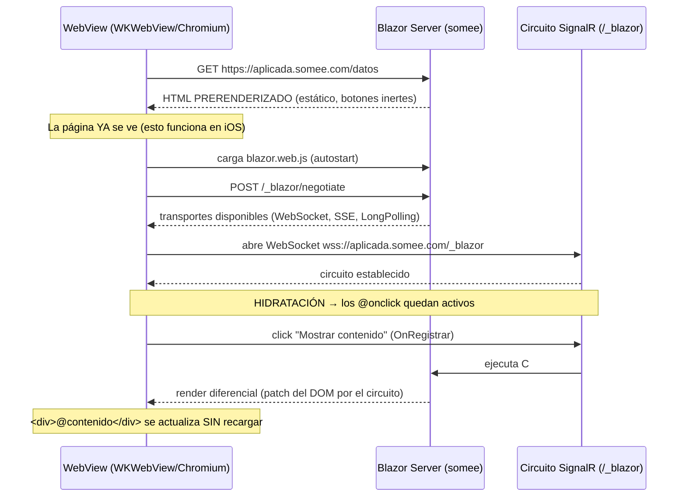
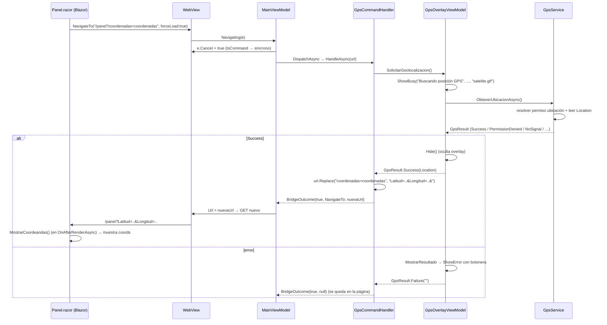

# App MAUI Híbrida con Blazor Interactive Server remoto

> Documenta el **principio de funcionamiento** del híbrido: una app **.NET MAUI** que hospeda en un
> `WebView` una web **Blazor Interactive Server** *remota* (`https://aplicada.somee.com`), cómo se
> consigue la **interactividad** de esas páginas (el circuito SignalR) y cómo funciona el **puente
> nativo por URL** (Canal B), con el **flujo GPS** como ejemplo detallado.
>
> Alcance de este documento:
> - El "esqueleto" de la solución (carga remota + interactividad por circuito) — §1–§4.
> - El **puente nativo por URL** (Canal B) y el **flujo GPS** en detalle — §5.
> - El **diagnóstico del fallo de iOS** (la página se ve pero los botones no responden) — §6–§7.
>
> Los demás comandos del Canal B tienen su propio documento:
> [`lectura-qr.md`](./lectura-qr.md) (QR) · [`captura-foto.md`](./captura-foto.md) (foto y selfie) ·
> [`llamada.md`](./llamada.md) (teléfono) · [`envio-api.md`](./envio-api.md) (relay REST / sendAPI).
>
> Proyectos analizados:
> - `Ejemplos_Devices/Integrada/Ejemplo_Maui_Hibrida` — el **contenedor** MAUI (el `WebView`).
> - `Ejemplos_Devices/Integrada/Ejemplo_ws_Blazor` — la **web** Blazor Interactive Server (las páginas).

---

## 1. Panorama general

La app es un **híbrido remoto**, no un híbrido local:

- **No** usa `BlazorWebView` (ese control hospeda Blazor *local*, desde el `wwwroot` del propio paquete).
- Usa el **`WebView` estándar de MAUI** apuntando a una **URL remota** (`MainPage.xaml.cs:18`). Para el
  control, la web Blazor es un **sitio opaco** servido por HTTPS, igual que cualquier página.

El `WebView` se materializa en el motor nativo de cada plataforma:

| Plataforma | Motor real del `WebView` |
|---|---|
| **iOS** | **`WKWebView`** (WebKit) |
| **Android** | **`android.webkit.WebView`** (Chromium / *System WebView*) |

Sobre esa base conviven **dos canales** independientes, que conviene no confundir:

```
┌──────────────────────────────────────────────────────────────────────────────┐
│  CONTENEDOR MAUI (Ejemplo_Maui_Hibrida)                                        │
│  ┌────────────────────────────────────────────────────────────────────────┐   │
│  │  WebView  →  WKWebView (iOS) / Chromium (Android)                        │   │
│  │  Source = "https://aplicada.somee.com"                                   │   │
│  │                                                                          │   │
│  │   Canal A · INTERACTIVIDAD de la página                                  │   │
│  │   Blazor Interactive Server  ── circuito SignalR (WebSocket) ──►  servidor│  │
│  │   (un @onclick sólo corre si este circuito está vivo)                    │   │
│  │                                                                          │   │
│  │   Canal B · ACCESO A DISPOSITIVOS                                        │   │
│  │   URL "marcada" (/panel?qr=qr&param=…) ── interceptada en Navigating ──► │   │
│  │   handler nativo (GPS/cámara/teléfono/REST)  → ver §5                    │   │
│  └────────────────────────────────────────────────────────────────────────┘   │
└──────────────────────────────────────────────────────────────────────────────┘
```

> **Clave — los dos canales están encadenados.** El Canal B (puente nativo) se dispara **desde** un
> `@onclick` de Blazor (p. ej. `OnQR` en `Panel.razor:248-252` hace `NavigateTo(..., forceLoad:true)`).
> Ese `@onclick` pertenece al **Canal A**. Por lo tanto, **si el circuito (Canal A) está caído, los
> botones que disparan dispositivos (Canal B) tampoco responden**: el click nunca llega al servidor que
> ejecutaría el `NavigateTo`. Esto explica por qué en iOS **toda** la interacción web de `Panel.razor`
> queda muerta, no sólo `Datos.razor`.

Excepción: los **botones nativos MAUI** del pie (`MainPage.xaml:50-52`: *Geo Posicionar*, *Llamar*,
*Leer QR*) invocan comandos del ViewModel **directamente**, sin pasar por la web; ésos sí funcionan en
iOS aunque el circuito esté caído (ver §5.5).

---

## 2. Componentes que participan

### 2.1 Lado web (`Ejemplo_ws_Blazor`, .NET 10)

| Componente | Archivo | Rol |
|---|---|---|
| `Program.cs` | `Ejemplo_ws_Blazor/Program.cs` | Registra Razor Components + render mode Server; arma el pipeline |
| `App.razor` | `Components/App.razor` | Documento raíz; carga `blazor.web.js`; aloja `ReconnectModal` |
| `Routes.razor` | `Components/Routes.razor` | Router (sin render mode propio → SSR estático) |
| `Datos.razor` | `Components/Pages/Datos.razor` | Página de prueba de interactividad (`InputText` + botón) |
| `Panel.razor` | `Components/Pages/Panel.razor` | Página de pruebas de dispositivos (botones que disparan el Canal B) |
| `ReconnectModal.razor` | `Components/Layout/ReconnectModal.razor` | UI estándar de reconexión del circuito |

### 2.2 Lado contenedor (`Ejemplo_Maui_Hibrida`, .NET 10 / MAUI 10.0.80)

| Componente | Archivo | Rol |
|---|---|---|
| `MainPage` | `Pages/MainPage.xaml(.cs)` | Aloja el `WebView`; fija la URL remota; cablea behaviors y overlays |
| `MainViewModel` | `ViewModels/MainViewModel.cs` | Expone `Url`; intercepta `Navigating` (Canal B) |
| `UrlCommandDispatcher` + handlers | `UrlCommands/**` | Implementan el Canal B (ver §5 y los docs por comando) |
| Behaviors del puente | `Behaviors/WebViewBridge*.cs` | Inyectan JS en el DOM vivo (`EvaluateJavaScriptAsync`) |
| Overlays de estado | `ViewModels/*OverlayViewModel.cs`, `Controls/StatusOverlayView.xaml` | Capa visual (GPS/Red/Llamada) sobre el `WebView` |
| Config iOS | `Platforms/iOS/Info.plist`, `Entitlements*.plist` | ATS (ausente), permisos de cámara/ubicación |
| Config Android | `Platforms/Android/AndroidManifest.xml`, `Resources/xml/network_security_config.xml`, `Resources/raw/*.pem` | Cleartext + anclas de confianza embebidas |

---

## 3. Canal A — cómo se vuelve "interactiva" la web

Blazor **Interactive Server** no entrega una página viva en el primer GET. Entrega HTML **estático
prerenderizado** y recién *después* lo "hidrata" cuando un **circuito SignalR** se conecta de vuelta al
servidor. Hasta que ese circuito vive, **cada `@onclick` está apagado**. Ésta es la idea central para
entender el bug de iOS.

### 3.1 El render mode es por página y con prerender ON

El modo interactivo se **registra** en el servidor pero **no se fuerza globalmente**:

```csharp
// Program.cs:13
builder.Services.AddRazorComponents()
    .AddInteractiveServerComponents(o => o.DetailedErrors = true);

// Program.cs:42
app.MapRazorComponents<App>().AddInteractiveServerRenderMode();
```

En `App.razor`, ni `<HeadOutlet/>` (`:14`) ni `<Routes/>` (`:18`) llevan `@rendermode` → la raíz del
documento es **SSR estático**. La interactividad es **opt-in por componente**:

```razor
@* Datos.razor:1-5 *@
@page "/datos"
@page "/"
@rendermode InteractiveServer
@attribute [StreamRendering]
```

```razor
@* Panel.razor:7-8 *@
@rendermode InteractiveServer
@attribute [StreamRendering]
```

> **Clave — `[StreamRendering]` ≠ interactividad.** `[StreamRendering]` sólo afecta a la fase de
> *streaming* del prerender (permite emitir HTML por partes durante el primer render SSR). **No** crea
> el circuito ni hace interactivos los botones. La interactividad la da exclusivamente
> `@rendermode InteractiveServer` **una vez conectado el circuito**.

> **Clave — prerender ON (por defecto).** Ninguna de las dos páginas usa
> `@rendermode @(new InteractiveServerRenderMode(prerender: false))`. Por eso el primer GET devuelve la
> página **ya dibujada** (se ven el `InputText`, los botones, las tarjetas)… pero **inerte**.

### 3.2 El arranque del circuito

`App.razor:20` carga el bootstrap del framework, con **autostart por defecto** (no hay `autostart="false"`
ni `Blazor.start({...})` personalizado en ningún lado):

```razor
@* App.razor:19-20 *@
<ReconnectModal />
<script src="@Assets["_framework/blazor.web.js"]"></script>
```

`blazor.web.js` entonces, automáticamente:

1. Hace `POST /_blazor/negotiate` (descubre transportes disponibles).
2. Abre el **circuito SignalR**, **prefiriendo WebSocket** (`wss://aplicada.somee.com/_blazor`); si
   falla, degrada a **Server-Sent Events** y luego **Long Polling**.
3. **Hidrata** los componentes `InteractiveServer` prerenderizados → recién ahí los `@onclick` quedan
   "enchufados".

No hay configuración de transporte ni `HubOptions` en el servidor (sólo `DetailedErrors = true`,
`Program.cs:13`): se usa la **negociación por defecto** de SignalR. El `MapBlazorHub` interno lo agrega
`AddInteractiveServerRenderMode()` (`Program.cs:42`); por eso **no** hay un `app.MapBlazorHub()`
explícito (correcto en .NET 8+).

### 3.3 La cadena que DEBE cumplirse para que un click funcione

Para que un click en `Datos.razor` (`OnRegistrar`, `:29-32`) o `Panel.razor` (`OnTest`, `:270-273`)
ejecute código C#, **todo** esto debe pasar, en orden:

```
(1) GET inicial  → HTML PRERENDERIZADO            ✔ funciona en iOS (la página se ve)
(2) carga blazor.web.js + autostart               ↓
(3) POST /_blazor/negotiate                        ↓
(4) abre circuito SignalR  (wss:// preferido)      ✗  ← acá se rompe iOS
(5) hidrata componentes InteractiveServer          ↓
(6) el @onclick viaja por el circuito, corre C#,   ↓
    y el render diferencial vuelve por el circuito ↓
```

> **Clave — la trampa del prerender.** El paso (1) **siempre** funciona (es HTML servido por HTTPS), así
> que la UI **parece completa**. Si el paso (4) falla, los pasos (5)-(6) nunca ocurren: la página se
> **ve** perfecta pero **todos** los botones están muertos. Es exactamente el síntoma reportado en iOS
> ("parece como si la página no fuese interactive server").

### 3.4 Diagrama de secuencia (camino feliz)



### 3.5 Middleware del servidor que puede afectar a un cliente remoto

Pipeline en `Program.cs:36-45`:

| Línea | Middleware | Riesgo para un cliente remoto/WebView |
|---|---|---|
| `:37` | `UseHttpsRedirection()` **activo** | Detrás del proxy TLS de somee, sin *forwarded headers*, el server puede ver el request como `http` y redirigir/derivar mal el esquema |
| `:39` | `UseAntiforgery()` **activo** | El token de antiforgery se emite en el prerender y se valida en el handshake; si el WebView descarta/rescribe cookies, el circuito puede abortar |
| — | `UseForwardedHeaders()` **AUSENTE** | Sin esto, detrás de un terminador TLS el server no conoce el esquema/host reales → puede construir mal la URL del circuito |
| `:33` | `UseHsts()` **comentado** | (sin efecto) |

> Estas carencias son **agravantes**, no la causa exclusiva: como Android funciona contra el **mismo**
> servidor, el diferenciador del fallo iOS está **en el cliente** (WKWebView) o en cómo WKWebView
> interactúa con esos middlewares. Ver §7.

---

## 4. El contenedor MAUI: cómo hospeda y observa la web

### 4.1 `WebView` + URL + behaviors

```xml
<!-- MainPage.xaml:26-38 -->
<WebView x:Name="webView" Source="{Binding Url}">
    <WebView.Behaviors>
        <behaviors:WebViewBridgeBehavior Bridge="{Binding WebBridge}" />
        <toolkit:EventToCommandBehavior EventName="Navigating"  ... Command="{Binding ...NavigatingCommand}" />
        <toolkit:EventToCommandBehavior EventName="Navigated"   ... Command="{Binding ...NavigatedCommand}" />
    </WebView.Behaviors>
</WebView>
```

```csharp
// MainPage.xaml.cs:18
mainViewModel.Url = "https://aplicada.somee.com";
```

- `Source="{Binding Url}"` (`MainPage.xaml:26`) → el `WebView` navega a lo que tenga `MainViewModel.Url`
  (`[ObservableProperty]`). El VM puede reasignar `Url` en runtime para re-navegar (clave para el flujo
  GPS; ver §5.4).
- **No hay** ninguna personalización nativa del `WebView` (sin handler/mapper de `WKWebView` ni de
  Android WebView). El control es 100% estándar; toda la lógica de plataforma vive en la **config**
  (Info.plist / manifest), no en código.

### 4.2 Dos tipos de pulsación

| Origen del click | Mecanismo | ¿Necesita el circuito? | ¿Funciona en iOS hoy? |
|---|---|---|---|
| Botón **dentro de la web** (`Datos`/`Panel`) | `@onclick` Blazor → circuito SignalR | **Sí** | **No** (circuito caído) |
| Botón **nativo MAUI** del pie (`MainPage.xaml:50-52`) | Command del VM (`TakeGPSCommand`, …) | No | Sí (con matices; ver §5.5) |

---

## 5. Canal B — el puente nativo por URL (con el flujo GPS en detalle)

El Canal B permite que la web pida capacidades nativas (GPS, cámara, teléfono, REST) que el `WebView`
no expone. El mecanismo es una **convención sobre la URL**: la web navega a una URL "marcada", la app
la intercepta en `Navigating`, la cancela y ejecuta un **handler** nativo.

### 5.1 Anatomía del puente

| Pieza | Archivo | Rol |
|---|---|---|
| `MainViewModel.Navigating` | `MainViewModel.cs:69-81` | Intercepta la navegación; cancela síncrono; delega en el dispatcher; aplica el resultado |
| `UrlCommandDispatcher` | `UrlCommands/UrlCommandDispatcher.cs` | *First-match-wins* sobre los handlers |
| `IUrlCommandHandler` (N impls) | `UrlCommands/Handlers/*` | Un comando = una clase (`CanHandle` + `HandleAsync`) |
| `BridgeOutcome` | `UrlCommands/BridgeOutcome.cs` | Resultado: ¿cancelar navegación? ¿re-navegar a qué URL? |
| `IWebViewBridge` + `WebViewBridgeBehavior` | `Behaviors/*` | Ejecutan JS / recargan el `WebView` (única pieza que toca el control) |

El núcleo de la intercepción (`MainViewModel.cs:69-81`):

```csharp
[RelayCommand]
private async Task Navigating(WebNavigatingEventArgs e)
{
    if (_dispatcher.IsCommand(e.Url))
        e.Cancel = true;                       // sincrónico: cancelar ANTES de cualquier await

    var outcome = await _dispatcher.DispatchAsync(e.Url);

    if (outcome.NavigateTo is not null)
        Url = outcome.NavigateTo;              // ← rama de re-navegación (GPS)

    IsRefreshing = false;
}
```

> **Clave — `e.Cancel` síncrono.** La cancelación del `WebView` debe ocurrir **antes** del primer
> `await`; por eso el dispatcher expone `IsCommand` (síncrono, sólo decide cancelar) y `DispatchAsync`
> (asíncrono, ejecuta). Idéntico criterio en todos los comandos.

### 5.2 Catálogo de comandos

Orden de registro = orden de evaluación (`MauiProgram.cs:90-95`), *first-match-wins*:

| Orden | Comando (URL) | Handler | Salida | Documento |
|---|---|---|---|---|
| 1 | `coordenadas=coordenadas` | `GpsCommandHandler` | **Re-navega** con `Latitud`/`Longitud` | **§5.4 (este doc)** |
| 2 | `phone=phone` | `CallCommandHandler` | Efecto nativo + overlay | [`llamada.md`](./llamada.md) |
| 3 | `photo=photo&param=…` | `CameraCommandHandler` | Inyecta imagen (JS) | [`captura-foto.md`](./captura-foto.md) |
| 4 | `selfie=selfie&param=…` | `SelfieCommandHandler` | Inyecta imagen (JS) | [`captura-foto.md`](./captura-foto.md) |
| 5 | `qr=qr&param=…` | `QrCommandHandler` | Inyecta texto (JS) | [`lectura-qr.md`](./lectura-qr.md) |
| 6 | `sendAPI=sendAPI&…` | `SendApiCommandHandler` | Inyecta respuesta REST (JS) | [`envio-api.md`](./envio-api.md) |

### 5.3 Las tres formas de "devolver" un resultado (ramas de `BridgeOutcome`)

`BridgeOutcome(bool CancelNavigation, string? NavigateTo = null)`. Los comandos siempre cancelan la
navegación original; se diferencian en **cómo entregan** el resultado:

1. **Inyectar JS y quedarse** (`NavigateTo == null` + `RunScript`): QR, foto, selfie, sendAPI. El
   resultado aterriza en un elemento del DOM (por `param`) vía `EvaluateJavaScriptAsync`, sin recargar.
2. **Re-navegar con query params** (`NavigateTo != null`): **sólo GPS**. El handler **reescribe** la
   URL con el resultado; `MainViewModel` asigna `Url = outcome.NavigateTo` y el `WebView` hace un GET
   nuevo. La web lee el resultado con `[SupplyParameterFromQuery]`.
3. **Sólo efecto nativo + overlay** (`NavigateTo == null`, sin `RunScript`): la llamada. No devuelve
   nada al DOM; el estado se comunica por el overlay nativo.

### 5.4 Flujo detallado: GPS (`coordenadas=coordenadas`)

GPS es el ejemplo canónico de la **rama de re-navegación** (forma 2) y además usa un **overlay de
estado** animado. Por eso se detalla aquí.

#### 5.4.1 El "protocolo"

```
/panel?coordenadas=coordenadas         (sin param: el resultado vuelve por la URL, no por el DOM)
```

Origen en la web (`Panel.razor:144-147`):

```csharp
public void OnSolicitarCoordenadas()
    => Navigation.NavigateTo("/panel?coordenadas=coordenadas", forceLoad: true);
```

La app reescribe esa URL y re-navega a:

```
/panel?Latitud=-31.7496689&Longitud=-60.5213019&
```

que la web lee con parámetros de query (`Panel.razor:151-155`):

```csharp
[SupplyParameterFromQuery] public double Latitud  { get; set; }
[SupplyParameterFromQuery] public double Longitud { get; set; }
```

#### 5.4.2 Diagrama de secuencia



#### 5.4.3 El overlay de estado

`GpsCommandHandler.HandleAsync` (`GpsCommandHandler.cs:19-34`) no toca la UI: delega en
`GpsOverlayViewModel.SolicitarGeolocalizacion` (`GpsOverlayViewModel.cs:22-38`), que muestra la capa de
espera y traduce el resultado:

```csharp
ShowBusy("Buscando posición GPS", "Aguarde unos segundos, y será redirigido automáticamente", "satelite.gif");
var result = await _gpsService.ObtenerUbicacionAsync();
if (result is GpsResult.Success) { Hide(); return result; }
MostrarResultado(result);                    // ShowError con acciones (Pedir permiso / Ajustes / Cerrar)
return new GpsResult.Failure("");
```

El overlay se renderiza con `StatusOverlayView` **encima** del `WebView`, ligado a
`GpsOverlayViewModel` (`MainPage.xaml:43`). Su base `StatusOverlayViewModel` (`:28`) modela tres
estados (`None`/`Busy`/`Error`) con `ShowBusy` (`:54-61`), `ShowError` (`:64-74`) y `Hide` (`:77`).
`GpsService.ObtenerUbicacionAsync` (`GpsService.cs:16-70`) resuelve el permiso de ubicación
(`RequestAsync`, `:78-106`) y lee la posición (último `LastKnownLocation` reciente o `GetLocationAsync`,
`:44-51`), devolviendo un `GpsResult` tipado (`Models/GpsResult.cs`).

#### 5.4.4 La reescritura de URL y el regreso a Blazor

Sólo en el caso `Success`, el handler reescribe la URL y pide re-navegar
(`GpsCommandHandler.cs:23-30`):

```csharp
if (result is GpsResult.Success s)
{
    var next = url.Replace("coordenadas=coordenadas",
        $"Latitud={s.Location.Latitude}&Longitud={s.Location.Longitude}&",
        StringComparison.OrdinalIgnoreCase);
    return new BridgeOutcome(true, next);     // ← re-navegar
}
return new BridgeOutcome(true, null);         // error: el overlay ya lo muestra; se queda
```

`MainViewModel.Navigating` detecta `outcome.NavigateTo is not null` y asigna `Url = outcome.NavigateTo`
(`MainViewModel.cs:77-78`) → el `WebView` hace un **GET nuevo** a `/panel?Latitud=…&Longitud=…&`. La web
recibe los valores por `[SupplyParameterFromQuery]` y los muestra en `MostrarCoordeandas`
(`Panel.razor:157-164`), invocado desde `OnAfterRenderAsync(firstRender)` (`:126`).

#### 5.4.5 Lógica y decisiones (GPS)

| Decisión | Dónde | Por qué |
|---|---|---|
| GPS **re-navega** en vez de inyectar JS | `GpsCommandHandler.cs:25-29` | El resultado (lat/lng) entra como estado de la página vía query params, no como texto del DOM |
| Handler delega en el VM del overlay | `GpsCommandHandler.cs:21` | El estado visual (busy/error) vive en el overlay, no en el handler |
| `GpsResult` tipado + `switch` | `Models/GpsResult.cs`, `GpsOverlayViewModel.cs:77-119` | Cada escenario (permiso, sin señal, GPS apagado, …) con su UI; sin `try/catch` en el VM |
| `LastKnownLocation` reciente antes de `GetLocationAsync` | `GpsService.cs:44-49` | Respuesta rápida si hay un fix de < 1 min; si no, lee en vivo |
| Trailing `&` en la URL reescrita | `GpsCommandHandler.cs:26` | Simplifica el `Replace`; es inocuo en el parseo del query |

### 5.5 GPS y el bug de iOS: la doble dependencia del circuito

El flujo GPS ilustra bien la trampa del Canal A (§3):

- **Disparo desde la web** (`OnSolicitarCoordenadas`, botón `@onclick`): en iOS, con el circuito caído,
  el click **no llega** al servidor → el flujo GPS ni siquiera arranca desde la web.
- **Disparo desde el botón nativo** "Geo Posicionar" (`TakeGPS`, `MainViewModel.cs:56-67`): funciona sin
  circuito para **acceder al dispositivo** (permiso + lectura GPS + reescritura de URL). Pero el
  **display final** de las coordenadas depende de `MostrarCoordeandas`, que corre en
  `OnAfterRenderAsync` (`Panel.razor:126`) — y eso **sí** necesita el circuito. Resultado en iOS: el GPS
  se lee y la URL se reescribe con lat/lng, pero **el `<div>` de coordenadas no se actualiza** porque el
  prerender no ejecuta `OnAfterRenderAsync`.

Moraleja: los botones nativos evitan el Canal A para el **acceso al dispositivo**, pero no para el
**render del resultado** cuando ese render vive en un hook interactivo de Blazor.

---

## 6. Configuración por plataforma: la asimetría

Todo el "remedio de red" para `aplicada.somee.com` vive **sólo en Android**. iOS **no tiene equivalente**.

| Concern | Android | iOS |
|---|---|---|
| Tráfico en claro (cleartext) | `usesCleartextTraffic="true"` (`AndroidManifest.xml:8`) + `cleartextTrafficPermitted="true"` | **Prohibido** (ATS por defecto) |
| Anclas de confianza para el dominio | `isrg_root_x2` + `root_ye` + `ye2` embebidos (`network_security_config.xml`) | **Ninguna** (iOS no tiene mecanismo para añadir anclas) |
| Excepción de transporte (ATS) | n/a | **`NSAppTransportSecurity` AUSENTE** en `Info.plist` → ATS estricta |
| Inspección del WebView | n/a | `webView.Inspectable = true` **comentado** (`MainPage.xaml.cs:20-23`) |

```xml
<!-- Platforms/Android/Resources/xml/network_security_config.xml -->
<domain-config>
    <domain includeSubdomains="true">aplicada.somee.com</domain>
    <trust-anchors>
        <certificates src="system" />
        <certificates src="@raw/isrg_root_x2" />
        <certificates src="@raw/root_ye" />
        <certificates src="@raw/ye2" />
    </trust-anchors>
</domain-config>
```

**Por qué Android necesitó esto** (detalle en [`../certificados-ssl/README.md`](../certificados-ssl/README.md)):
la cadena del sitio termina en **`ISRG Root X2`** (raíz ECDSA de Let's Encrypt/ISRG, 2020). El servidor
envía hoja + 2 intermedios (`YE2`, `Root YE`) y **espera que el cliente ya tenga la raíz**. Un **Android
viejo (Moto g42)** no la tiene y **no hace AIA fetching**, así que la cadena queda abierta → el GET
mismo fallaba. Por eso se embebió la raíz (y los intermedios) como anclas para ese dominio.

> **Clave para el diagnóstico.** Ese problema de cadena es **de Android viejo**. En iOS la situación es
> distinta (ver §7.2): iOS 15+ **sí** incluye `ISRG Root X2` y **sí** hace AIA, y empíricamente **la
> página carga en iOS**. Es decir: en iOS el TLS al host **ya valida**. Copiar el remedio de Android a
> iOS (embeber certificados) **no es posible ni necesario**; el fallo de iOS es de otra naturaleza.

---

## 7. Diagnóstico: por qué iOS no es interactivo

### 7.1 Acotando el problema

| Hecho observado | Qué implica |
|---|---|
| La página **se ve** en iOS (`Datos`/`Panel` muestran sus controles) | El **GET inicial por HTTPS funciona** → TLS + cadena + ATS para `https://` están OK en iOS |
| Los botones **no responden** en iOS | El **circuito SignalR no se establece/hidrata** (paso 4-5 de §3.3) |
| En Android **sí** responden | El diferenciador es **iOS-específico** (WKWebView), contra el **mismo** servidor |

Conclusión firme: **no es un problema de renderizado ni de confianza TLS al host**; es el **canal
interactivo persistente** que no se levanta en `WKWebView`.

### 7.2 Por qué (casi seguro) NO es el certificado en iOS

Tentación natural: "en Android se arregló embebiendo certificados; hagamos lo mismo en iOS". **No aplica**:

1. **Empírico:** si iOS no confiara en la cadena de `aplicada.somee.com`, el **GET inicial fallaría** y
   la página **no** se vería. Se ve → el TLS al host valida.
2. **Almacén de confianza:** iOS 15+ (deployment target del proyecto, `csproj:25`) incluye `ISRG Root X2`.
3. **AIA:** a diferencia de Android, iOS descarga intermedios faltantes vía *Authority Information Access*.
4. El `wss://` del circuito va al **mismo host, mismo puerto, mismo certificado** que el GET. Si el GET
   pasa ATS, el `wss://` pasa la misma evaluación de confianza.

> Por eso "embeber certificados en iOS" **se descarta** como causa principal. (iOS, además, **no tiene**
> un mecanismo tipo `network_security_config` para añadir anclas; lo único parametrizable es una
> **excepción ATS de política**, no de confianza.)

### 7.3 Causas candidatas (ordenadas por probabilidad)

| # | Causa | Mecanismo (diferenciador iOS vs Android) | Probabilidad |
|---|---|---|---|
| 1 | **Transporte + cookies en WKWebView** | somee *free* no sostiene WebSocket → SignalR cae a **Long Polling/SSE**, que en host compartido necesita **cookie de afinidad de sesión**. WKWebView aplica políticas de cookies/`SameSite`/ITP **más estrictas** que el Chromium de Android → la afinidad se pierde y el circuito nunca cierra | **Alta** |
| 2 | **Mixed-content / cleartext en el circuito** | Si por falta de `UseForwardedHeaders` el server deriva esquema `http`, el circuito podría intentar `ws://` (no `wss://`). Android **permite cleartext** (`usesCleartextTraffic`) y lo deja pasar; **iOS lo bloquea por ATS** (sin cleartext) → circuito muerto sólo en iOS | **Media-alta** |
| 3 | **Antiforgery / cookies de sesión** | `UseAntiforgery()` activo (`Program.cs:39`); si WKWebView descarta o particiona la cookie (ITP), el handshake del circuito puede rechazarse (4xx) donde Chromium lo tolera | **Media** |
| 4 | **ATS sobre el `wss://`** (política TLS) | ATS exige TLS 1.2+ con *forward secrecy*. Si el endpoint de socket negociara una suite no conforme, ATS lo bloquea aunque el GET pase. Poco probable (mismo host), pero barato de descartar | **Baja** |

> **Causa más probable (una frase):** el **circuito interactivo de Blazor Server no se sostiene en
> WKWebView** sobre un host gratuito compartido (somee) — sea por degradación a Long Polling con
> **cookie de afinidad** que WKWebView maneja distinto, sea por un **`ws://` cleartext** que la ATS de
> iOS bloquea y Android permite. Ambas se confirman/descartan con **un solo** paso (§7.4).

### 7.4 El diagnóstico decisivo (rápido y barato)

**Adjuntar Safari Web Inspector al `WKWebView` del dispositivo y leer Network + Console.** Es lo único
que separa las causas sin adivinar.

1. **Habilitar inspección** (temporal): descomentar `MainPage.xaml.cs:20-23`:
   ```csharp
   #if IOS
   if (OperatingSystem.IsIOSVersionAtLeast(16, 4))
       webView.Inspectable = true;
   #endif
   ```
   y en el dispositivo: *Ajustes → Safari → Avanzado → Inspector web*.
2. En la Mac: **Safari → Desarrollo → [dispositivo] → aplicada.somee.com**.
3. Cargar la página, pulsar un botón muerto y mirar:

| Lo que se observa en el Inspector | Causa implicada | Fix a aplicar |
|---|---|---|
| Línea `wss://…/_blazor` con **error TLS/conexión**; en *Console.app*: `NSURLErrorDomain -1200` / "App Transport Security has blocked…" | #2/#4 (ATS / cleartext / TLS) | Excepción ATS en `Info.plist` (§7.5) y/o `UseForwardedHeaders` en server |
| **Sin** `101 Switching Protocols`; en su lugar **Long Polling** repetido a `/_blazor?id=…`, `ReconnectModal` en bucle, "circuit failed to initialize" | #1 (WebSocket no soportado + afinidad) | Cookie de afinidad `SameSite=None; Secure`, o cambiar de host / render mode (§7.5) |
| `400`/`403` en `/_blazor` (antiforgery), sin error TLS | #3 (cookies/antiforgery) | Cookies `SameSite=None; Secure`; revisar antiforgery tras proxy |
| Intento de `ws://` (no `wss://`) bloqueado como *mixed content* | #2 (esquema mal derivado) | `UseForwardedHeaders` + forzar `wss`/HTTPS en el server |

> **Atajo de confirmación para #2/#4:** si añadiendo una **excepción ATS** (o, sólo como prueba,
> `NSAllowsArbitraryLoadsInWebContent=true`) en `Info.plist` el circuito conecta, queda **probado** que
> la causa era ATS/cleartext. Si **no** cambia nada, la causa es de transporte/cookies (#1/#3) y el
> arreglo es server-side.

### 7.5 Soluciones propuestas (NO aplicadas — a confirmar)

Ordenadas de "rápida para diagnosticar" a "robusta de fondo". **Ninguna se ha aplicado**: requieren tu
confirmación.

1. **(Diagnóstico / iOS)** Añadir excepción ATS para el dominio en `Platforms/iOS/Info.plist`:
   ```xml
   <key>NSAppTransportSecurity</key>
   <dict>
     <key>NSExceptionDomains</key>
     <dict>
       <key>aplicada.somee.com</key>
       <dict>
         <key>NSIncludesSubdomains</key><true/>
         <key>NSExceptionRequiresForwardSecrecy</key><false/>
         <!-- Sólo como PRUEBA, para aislar la causa: -->
         <!-- <key>NSExceptionAllowsInsecureHTTPLoads</key><true/> -->
       </dict>
     </dict>
   </dict>
   ```
   Es el **paralelo iOS** del `network_security_config` de Android, pero de **política** (no de
   confianza). Sirve para **descartar** #2/#4.

2. **(Server)** Agregar `UseForwardedHeaders()` (con `ForwardedHeadersOptions` para `XForwardedProto`/`Host`)
   **antes** de `UseHttpsRedirection`, para que detrás del proxy TLS de somee el server derive `https`
   y el circuito use `wss://`. Mitiga #2.

3. **(Cookies)** Asegurar que las cookies de **afinidad de sesión** y de **antiforgery** salgan
   `SameSite=None; Secure`, para que WKWebView (ITP) las reenvíe en los requests del circuito. Mitiga #1/#3.

4. **(Hosting / arquitectura — el fix robusto)** El plan *free* de somee no es buen sustrato para un
   **circuito persistente** consumido desde un WebView móvil. Dos caminos de fondo:
   - **Cambiar el render mode** de las páginas a **Interactive Auto / WebAssembly** (no necesita circuito
     persistente ni afinidad), o
   - **Hospedar** la web donde **WebSocket** esté soportado y la **afinidad/ARR** garantizada (somee de
     pago / Azure / otro).

   Esta opción ataca la **raíz** (la dependencia de un circuito Server frágil) en lugar de los síntomas.

> Recomendación: **primero §7.4** (Web Inspector) para saber con certeza cuál de #1-#4 es; recién
> entonces aplicar la solución correspondiente. Cambiar config a ciegas puede tapar un síntoma y dejar
> la causa.

---

## 8. Dependencias y técnicas

| Técnica / dependencia | Dónde | Para qué |
|---|---|---|
| `WebView` estándar de MAUI (no `BlazorWebView`) | `MainPage.xaml:26` | Hospedar una web Blazor **remota** como sitio opaco |
| Blazor **Interactive Server** (.NET 10, modelo `blazor.web.js`) | `Program.cs:13,42`; `App.razor:20` | Interactividad por **circuito SignalR** |
| Render mode **por página** + **prerender ON** + `[StreamRendering]` | `Datos.razor:4-5`, `Panel.razor:7-8` | Opt-in de interactividad; primer paint estático |
| `CommunityToolkit.Maui` `EventToCommandBehavior` | `MainPage.xaml:30-36` | Llevar `Navigating`/`Navigated` del WebView al VM |
| `CommunityToolkit.Mvvm` (`[ObservableProperty]`, `[RelayCommand]`) | `MainViewModel.cs` | Binding de `Url` y comandos |
| Puente JS (`EvaluateJavaScriptAsync`) | `Behaviors/WebViewBridge*.cs` | Inyectar resultados en el DOM vivo (Canal B) |
| Re-navegación por query params + `[SupplyParameterFromQuery]` | `GpsCommandHandler.cs:25-29`, `Panel.razor:151-155` | Devolver el resultado GPS como estado de la página |
| Overlays de estado (`StatusOverlayViewModel`) | `ViewModels/*Overlay*.cs`, `Controls/StatusOverlayView.xaml` | Feedback nativo (busy/error) sobre el WebView |
| `network_security_config` + `res/raw/*.pem` (Android) | `Platforms/Android/**` | Cerrar la cadena `ISRG Root X2` en Android viejo |
| ATS por defecto (iOS, sin excepciones) | `Platforms/iOS/Info.plist` | (Origen del fallo de circuito; ver §7) |

Versiones: ambos proyectos en **.NET 10**; MAUI **10.0.80** (`Ejemplo_Maui_Hibrida.csproj:105`); deployment
target **iOS 15.0** / **Android API 25** (`csproj:25-26`).

---

## 9. Referencia rápida de archivos

### 9.1 Esqueleto híbrido y circuito (Canal A)

| Archivo | Líneas clave |
|---|---|
| `Ejemplo_ws_Blazor/Program.cs` | `13` (Server components), `37` (HttpsRedirection), `39` (Antiforgery), `42` (render mode) |
| `Ejemplo_ws_Blazor/Components/App.razor` | `14` (HeadOutlet), `18` (Routes), `19` (ReconnectModal), `20` (blazor.web.js) |
| `Ejemplo_ws_Blazor/Components/Pages/Datos.razor` | `1-5` (page+rendermode), `12-13` (InputText+botón), `29-32` (`OnRegistrar`) |
| `Ejemplo_ws_Blazor/Components/Pages/Panel.razor` | `7-8` (rendermode), `81` (botón test), `270-273` (`OnTest`) |
| `Ejemplo_Maui_Hibrida/Pages/MainPage.xaml` | `26-38` (WebView + behaviors), `43-47` (overlays), `50-52` (botones nativos) |
| `Ejemplo_Maui_Hibrida/Pages/MainPage.xaml.cs` | `18` (URL remota), `20-23` (`Inspectable` comentado) |

### 9.2 Puente nativo (Canal B) y flujo GPS

| Archivo | Líneas clave |
|---|---|
| `Ejemplo_ws_Blazor/Components/Pages/Panel.razor` | `144-147` (`OnSolicitarCoordenadas`), `151-155` (`SupplyParameterFromQuery`), `157-164` (`MostrarCoordeandas`), `248-252` (`OnQR`) |
| `Ejemplo_Maui_Hibrida/ViewModels/MainViewModel.cs` | `56-67` (`TakeGPS`), `69-81` (`Navigating`, intercepción) |
| `Ejemplo_Maui_Hibrida/UrlCommands/UrlCommandDispatcher.cs` | `15` (`IsCommand`), `17-27` (`DispatchAsync`) |
| `Ejemplo_Maui_Hibrida/UrlCommands/BridgeOutcome.cs` | record (cancelar / re-navegar) |
| `Ejemplo_Maui_Hibrida/UrlCommands/Handlers/GpsCommandHandler.cs` | `16-17` (`CanHandle`), `19-34` (`HandleAsync`), `25-29` (reescritura URL) |
| `Ejemplo_Maui_Hibrida/ViewModels/GpsOverlayViewModel.cs` | `22-38` (`SolicitarGeolocalizacion`), `77-119` (`MostrarResultado`) |
| `Ejemplo_Maui_Hibrida/Services/GpsService.cs` | `16-70` (`ObtenerUbicacionAsync`), `78-106` (permiso) |
| `Ejemplo_Maui_Hibrida/Models/GpsResult.cs` · `LocationPermissionResult.cs` | resultado / permiso tipados |
| `Ejemplo_Maui_Hibrida/ViewModels/StatusOverlayViewModel.cs` | `54-61` (`ShowBusy`), `64-74` (`ShowError`), `77` (`Hide`) |
| `Ejemplo_Maui_Hibrida/Controls/StatusOverlayView.xaml(.cs)` | UI del overlay |
| `Ejemplo_Maui_Hibrida/MauiProgram.cs` | `90-95` (orden de handlers) |

### 9.3 Configuración por plataforma

| Archivo | Líneas clave |
|---|---|
| `Ejemplo_Maui_Hibrida/Platforms/iOS/Info.plist` | **sin** `NSAppTransportSecurity`; `MinimumOSVersion 15.0` |
| `Ejemplo_Maui_Hibrida/Platforms/Android/AndroidManifest.xml` | `8` (`usesCleartextTraffic`), `9` (`networkSecurityConfig`) |
| `Ejemplo_Maui_Hibrida/Platforms/Android/Resources/xml/network_security_config.xml` | `domain-config` de `aplicada.somee.com` + anclas `@raw` |

> Documentación relacionada — comandos del Canal B:
> [`lectura-qr.md`](./lectura-qr.md) (QR) · [`captura-foto.md`](./captura-foto.md) (foto y selfie) ·
> [`llamada.md`](./llamada.md) (teléfono) · [`envio-api.md`](./envio-api.md) (relay REST).
> Cadena TLS y arreglo de Android: [`../certificados-ssl/README.md`](../certificados-ssl/README.md).
