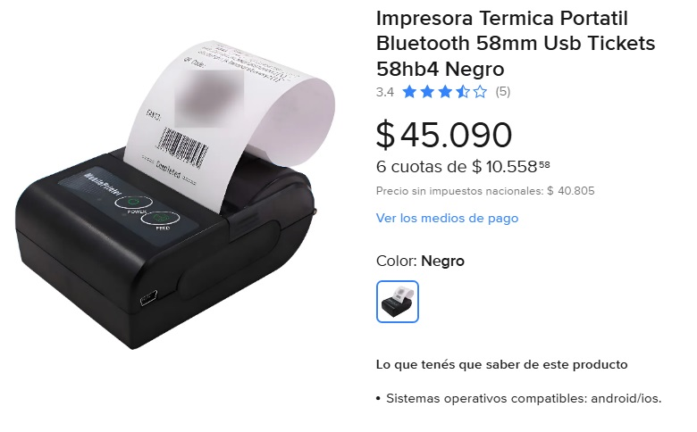



## Prompts Overview. 

Se detalla a continuación la metodologia seguida para la generación de los manuales técnicos, de usuario y 
de desarrollador para el proyecto Ejemplo_ThermalPrinter.


### [Prompt inicial a chat gpt, 01_Prompt_chatgpt.md](01_Prompt_chatgpt.md)

El objetivo es saber que manuales necesito generar, y que información debo incluir 
en cada uno de ellos.
Y a partir de eso generar el prompt para que copilot genere los manuales.

Se especifica el prompt y la respuesta en el fichero [01_Prompt_chatgpt.md](01_Prompt_chatgpt.md)

### [Prompt copilot](02_Prompt_copilot.md)

El objetivo es solicitarle a copilot que a partir de lo obtenido [01_Prompt_chatgpt.md](01_Prompt_chatgpt.md) 
genere los manuales con el contenido apropiado definido en el anterior prompt,
revisando y ajustando algunos detalles.

Así, extrayendo desde la respuesta obtenida en [01_Prompt_chatgpt.md](01_Prompt_chatgpt.md) se 
genera un prompt con las especificaciones necesarias, [02_Prompt_copilot.md](02_Prompt_copilot.md),
ubicandose dicho markdown en la raiz del proyecto Ejemplo_ThermalPrinter y luego 
por medio del siguiente prompt desde el copilot:

**Prompt**:
```
sigue al pie de la letra lo que dice #02_Prompt_copilot.md,
crea los documentos que se especifican ahí, podes ser consistente 
con lo desarrollado en el proyecto #Ejemplo_ThermalPrinter
```

se ejecuta generandose la siguiente documentación:

**Resultado**:

- 📘 [Manuales/01_MANUAL_USUARIO.md](../Manuales/01_MANUAL_USUARIO.md)
- 📘 [Manuales/02_MANUAL_TECNICO_ESC_POS.md](../Manuales/02_MANUAL_TECNICO_ESC_POS.md)
- 📘 [Manuales/03_GUIA_INTEGRACION_ESCPOS_NET.md](../Manuales/03_GUIA_INTEGRACION_ESCPOS_NET.md)

### [Prompt copilot sin planeamiento](03_Prompt_copilot_manual_borrador.md)

Aquí se realizó una solicitud a copilot de forma desestructurada.

Resultando en documento general:

**Prompt**:

```
me construis un nuevo archivo markdown con el formato de manual tecnico 
del dispositivo "Impresora Termica Portatil Bluetooth 58mm Usb Tickets 58hb4 Negro" 
de la imagen, el modelo es 58HB6-THERMAL-PRINTER. Quiero que me generes la 
documentación de las caracteristicas, otra parte respecto a lo que es el usuario,
otra relativa a lo especifico a la interfaz para su control, luego su libreria 
con ejemplos para cada una de sus operaciones o comandos o caracteristicas 
operativas, esas dos ultima estarian relacionadas con lo relativo al desarrollador.
```

**Resultado**:

- 📘 [Manuales/04_Borrador_Manual.md](../Manuales/04_Borrador_Manual.md)

Finalmente todos los documentos fueron movidos a otra carpeta junto con la documentación
de los prompts, para mantener el orden y la limpieza del proyecto.

La imagen utilizada fue: 



[Enlace publicación producto](https://www.mercadolibre.com.ar/impresora-termica-portatil-bluetooth-58mm-usb-tickets-58hb4/up/MLAU204365635?pdp_filters=item_id%3AMLA930763423&from=gshop&matt_tool=73566853&matt_word=&matt_source=google&matt_campaign_id=23390549168&matt_ad_group_id=199229768108&matt_match_type=&matt_network=g&matt_device=c&matt_creative=790066494623&matt_keyword=&matt_ad_position=&matt_ad_type=pla&matt_merchant_id=5724834191&matt_product_id=MLAU204365635&matt_product_partition_id=2456699013504&matt_target_id=pla-2456699013504&cq_src=google_ads&cq_cmp=23390549168&cq_net=g&cq_plt=gp&cq_med=pla&gad_source=1&gad_campaignid=23390549168&gbraid=0AAAAAD01zQYkTkxKwM50p_sc3vdLQAhwh&gclid=Cj0KCQiAwYrNBhDcARIsAGo3u30gg7BcrXY3m44N9VfZDBIGlvjbRr2FOaGU338Pvik0_as39ELU8TQaAkWcEALw_wcB)

